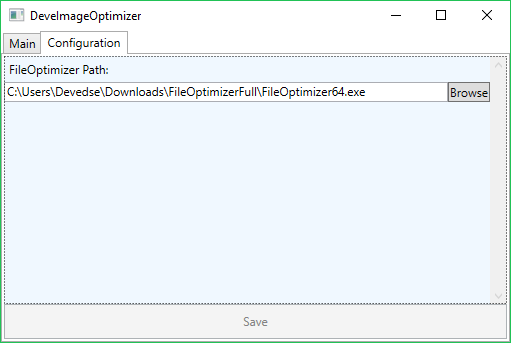

# DeveImageOptimizer
This tool uses FileOptimizer to recompress images: http://nikkhokkho.sourceforge.net/static.php?page=FileOptimizer

## Build status

| AppVeyor (Windows build) |
|:------------------------:|
|  |

## More information

This tool has some advantages/differences over the GUI for FileOptimizer:

| Number | Description | Implementation progress |
| --- | --- | --- |
| 1 | A basic UI using MVVM Light and some cool features from C# and WPF | 100% |
| 2 | It will remember all processed files, so it won't reprocess them again if they have already been optimized. | 100% |
| 3 | It will do a pixel for pixel comparison between the input/output and only replace the original if it matches 100% (this is just to be sure the image did not get corrupted) | 100% |
| 4 | If you select a folder it will only take PNG's, GIF's, JPEG's and BMP's from that folder to optimize, no other formats will be included | 100% |
| 5 | Automated builds / release | AppVeyor: 100% |
| 6 | Packing the whole build into one usable exe file (As of version 1.0.46) (Using ILMerge as ILRepack does not work at this moment) | 100% |

Basically as of version 1.0.46 this tool is fully usable. You can download the exe file from the releases page which can be ran if FileOptimizer is also installed.

The reason the .exe file is quite big is because it includes the full LibVips library to do JPEG conversion to do accurate comparison.

## Screenshot

