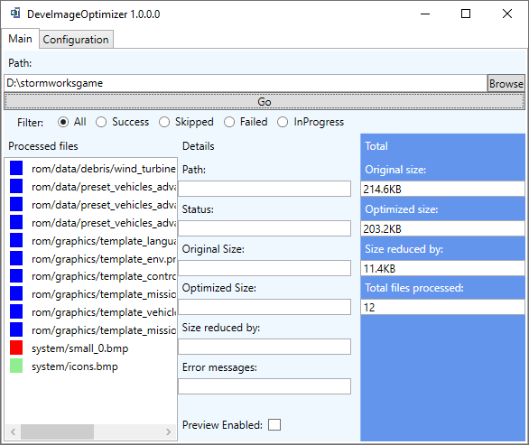
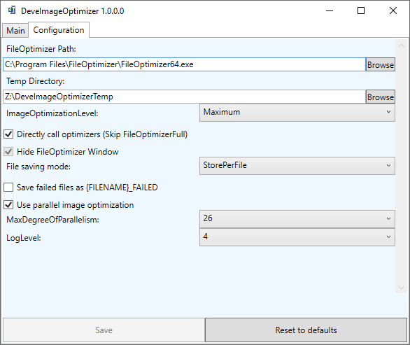

# DeveImageOptimizerWPF
This tool uses FileOptimizer to recompress images: http://nikkhokkho.sourceforge.net/static.php?page=FileOptimizer

The library used to do the Optimization and pixel by pixel comparing the images is named 
[DeveImageOptimizer](https://github.com/devedse/DeveImageOptimizer)

DeveImageOptimizerWPF has 2 main advantages over using Nikkho's FileOptimizer directly:
1. DeveImageOptimizerWPF kicks of optimization in parallel, thus being way quicker
1. DeveImageOptimizerWPF verifies images on a Pixel by Pixel basis to see if the result matches the input. (It happens sometimes that one of the 16 tools makes a mistake which could corrupt an image)

Also checkout Papa's Best Optimizer as an alternative to my tool, it also doesn't contain the Image verification part though:

https://papas-best.com/

Some other advantages of my application are the use of a modern programming language (debatable I know :smile:) C#. And having fully automated builds and releases using AppVeyor and Chocolatey:

https://chocolatey.org/packages/DeveImageOptimizerWPF

## Build status

| GitHubActions Builds |
|:--------------------:|
|  |

## Code Coverage status

| CodeCov |
|:-------:|
|  |

(Reason why Coverage is quite low is because a lot of tests can't run on the Build Server)

## Code Quality Status

| SonarQube |
|:---------:|
|  |

## Chocolatey

| Chocolatey |
|:-----:|
|  |

## More information

This tool has some advantages/differences over the GUI for FileOptimizer:

| Number | Description | Implementation progress |
| --- | --- | --- |
| 1 | A basic UI using MVVM Light and some cool features from C# and WPF | 100% |
| 2 | It will remember all processed files, so it won't reprocess them again if they have already been optimized. | 100% |
| 3 | It will do a pixel for pixel comparison between the input/output and only replace the original if it matches 100% (this is just to be sure the image did not get corrupted) | 100% |
| 4 | If you select a folder it will only take PNG's, GIF's, JPEG's and BMP's from that folder to optimize, no other formats will be included | 100% |
| 5 | Automated builds / release | AppVeyor: 100% |
| 6 | Packing the whole build into one usable exe file (As of version 1.0.46) (Using ILMerge as ILRepack does not work at this moment) | 100% |

Basically as of version 1.0.46 this tool is fully usable. You can download the exe file from the releases page which can be ran if FileOptimizer is also installed.

The reason the .exe file is quite big is because it includes the full LibVips library to do JPEG conversion to do accurate comparison.

## Screenshots

